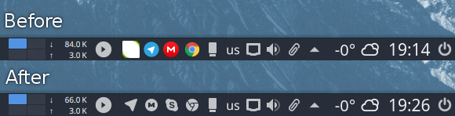

<p align="center">
  
</p>

# About
Papirus - it's SVG icon theme for Linux, based on [Paper](https://github.com/snwh/paper-icon-theme) with more additionals (hardcode-tray support, libreoffice icon theme, filezilla theme, smplayer themes ...) and modifications. Available light and dark version for GTK and KDE.

# Install / Update
## ROOT directory
```
wget -O - https://raw.githubusercontent.com/PapirusDevelopmentTeam/papirus-icon-theme-kde/master/install-papirus-root.sh | bash
```
## HOME directory
```
wget -O - https://raw.githubusercontent.com/PapirusDevelopmentTeam/papirus-icon-theme-kde/master/install-papirus-home.sh | bash
```
**Depends:**
- wget
- p7zip-full
- libqt4-svg (optional, need for right work on Qt4-apps)

For easy way update you can add bash alias `update-papirus`:
```
echo 'alias update-papirus="wget -O - https://raw.githubusercontent.com/PapirusDevelopmentTeam/papirus-icon-theme-kde/master/install-papirus-home.sh | bash"' >> ~/.bashrc
```

# Remove
```
wget -O - https://raw.githubusercontent.com/PapirusDevelopmentTeam/papirus-icon-theme-kde/master/remove-papirus.sh | bash
```

# Hardcoded tray icons

Papirus now support [Hardcode-Tray](https://github.com/bil-elmoussaoui/Hardcode-Tray) script



# Recommends
- For beter looking use icons with [Arc Dark KDE](https://github.com/varlesh/Arc-Dark-KDE)

# Icon request
- Application name
- Icon name (see desktop-file option **Icon** on `/usr/share/applications`)
- Original icon image

# Donate
If you like my project , you can donate:

<span class="paypal"><a href="https://www.paypal.me/varlesh" title="Donate to this project using Paypal"></a></span>

<span class="Yandex.Money"><a href="http://yasobe.ru/na/varlesh#form_submit" title="Donate to this project using Yandex.Money"></a></span>

# License
GNU LGPL v3
